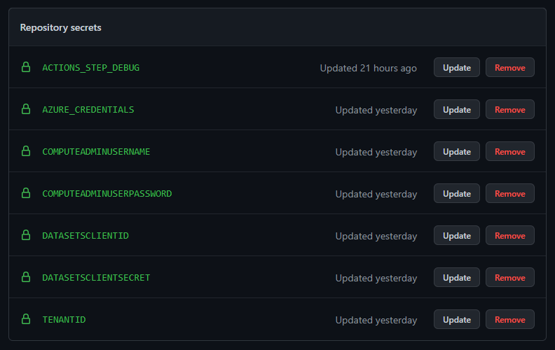
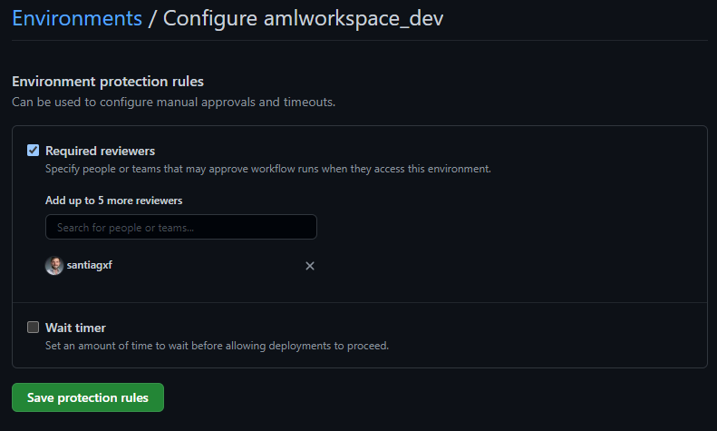

# Quick start for GitHub Actions

This guide will guide you to configure this project in GitHub Actions.

## Configure a your connection to Azure

The automated pipelines in this repository will interact with Azure Machine Learning resources located in an Azure subcription. In order to do that, we need to create a special secret in GitHub to connect using the service principal created before.

To do that:
1. Go to settings in your repository.
2. Click on `Secrets`.
3. Select `New repository secret`.
4. Create the GitHub secrets to access your Azure environment. All the jobs in this repository will try to pull the credentials to access Azure using a secret called `AZURE_CREDENTIALS`. You should create this secret and populate it with the information of the Service Principal that you want to use for deployment. If you don't have Service Principal created, [you can create one following this steps](https://docs.microsoft.com/en-us/azure/active-directory/develop/howto-create-service-principal-portal). The secrets have to be stored JSON format. [Check this guide to know how](https://github.com/marketplace/actions/azure-login#configure-deployment-credentials).

## Configure your environment variables

The automated pipelines in this repository will use a set of variables to configure how the deployment should be done and where. Those variables are located in a `YAML` file at `.github/variables.yaml`.

> Note: Placing configuration inside the a `YAML` file in the repository may not be the best choice in an enterprise setting. In this repository is used to reduce the amount of configuration needed.

Open the file and review the values of the following variables. Save the changes in this file and commit the changes to the repo.

- `WORKSPACENAME`: The name of the Azure Machine Learning workspace you want to use.
- `RESOURCEGROUPNAME`: The name of the resource group where the resources are located.
- `STORAGEACCOUNTNAME`: The name of the storage account where you want datasets to be placed. This datastorage account has to have a container named `trusted` and be configured as a data source in Azure Machine Learning with the name `trusted`.
- `LOCATION`: The location where resources are deployed by IaC
- `KEYVAULTNAME`: Name of the keyvault object where elements are stored. Leave the default `kv-trunkbased-dev` since it is created by IaC.

The following variables are also present, but are specific to the project you are working on.

- `ENVPREFIX`: Name of the environment. By default its `dev` reffering to `development`. Possible values can be `qa`, `stg` and `prd`.
- `modelName`: The name of the model you are building. 
- `description`: Description of the model you are building.
- `condaEnvName`: Name of the environment that the model uses for training. This environment should match any of the environments that are available under the folder `environments`.

## Configure secrets

Infrastructure is deployed automatically by IaC pipelines. However, some secrets are required and needs to be provided in the form of Azure DevOps Variable Group. To configure that:

1. Go to settings in your repository.
2. Click on `Secrets`.
3. Select `New repository secret`.
3. Name secrets and configure the following secrets:

    - `datasetsClientId`: The Client ID of the service principal created before.
    - `datasetsClientSecret`: The Client Secret of the service principal created before.
    - `computeAdminUserName`: The user name of the compute instances you want to use. For instance `mladmin`.
    - `computeAdminUserPassword`: The password used for compute instances. For instance `Pass@word1`.

It should look like something like this:

## Create the pipelines

All pipelines will be created automatically by GitHub.

## Configure repository policies

1. On the navigation bar in the top of the page, select `settings`.
2. Click on `branches`
3. On the section `Branch protection rules`, click on `Add rule`
4. Prevent direct access to `main`. Optionally, require approvers. 

    

7. Save the changes.

## Configure approval gates

Certain actions in the pipeline, like a deployment, will require approval. To configure how approval works:

1. On the navigation bar in the top of the page, select `settings` and then `Environments`.
2. You will see environments automatically added, named `amlworkspace_dev` and `dev`. Click on `amlworkspace_dev`.
3. Check the option `Required reviewers` and add the required approvers. Stages like model registration and model deployment will go over this gate.

    

4. Save the protection rules.

## Getting the project runnning

Run pipelines in the following order:

1. workspace-CD
2. environment-CD
3. model-CD

